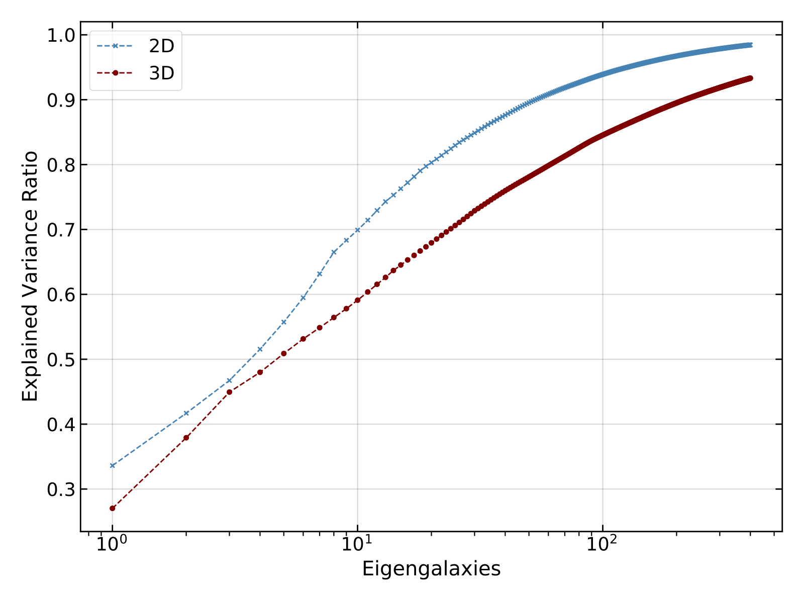
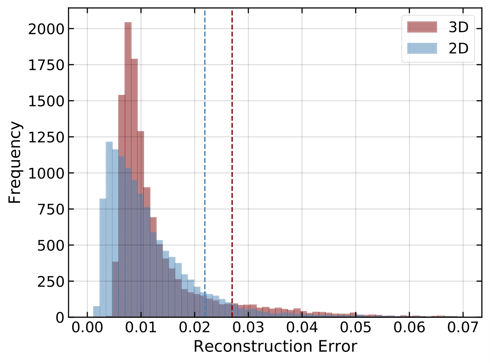
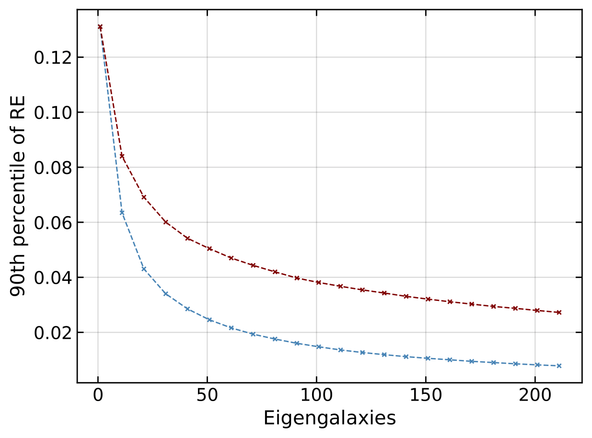

# Benchmark Results

## Eigengalaxies
The calculated principal components are called *eigengalaxies* and span the lower dimensional image space. The eigengalaxies are shown below for the 2D case,they are ordered by their explained variance ratio (EVR), which is the fraction of the total variance explained by each eigengalaxy.
### Metallicity

### Stellar Age

### Masses

## Explained Variance Ratio

_Figure 2: Left: Cumulative explained variance ratio (EVR) for up to 400 eigengalaxies: Achieving the same explained variance requires significantly more eigengalaxies in 3D compared to 2D. To surpass an 90% EVR, ∼ 60 (215) eigengalaxies are needed in 2D (3D)._

## Reconstruction Error
We define the reconstruction error (RE) as the fractional difference in pixel values between the PCA representation, $\hat{\mathbf{I}}$, and the original image, $\mathbf{I}$ as 
$$\text{RE} = \frac{\sum_{k=1}^{d} (I_k-\hat{I}_k)^2}{\sum_{k=1}^{d} I_k}$$

_Figure 3: Reconstruction error (RE) for fixed-dimensionality reduction on 60 (215) eigengalaxies in 2D (3D). The dashedline represents the 90% quantile. Impressively, 90% of all images exhibit a RE below 0.022 (0.027)._

_Figure 4: 90th percentile of RE as a function of the number of eigengalaxies. Reconstruction is a strong function of eigengalaxies, and already 15 (60) eigengalaxies lead to a RE better than 5% in 2D (3D)._
